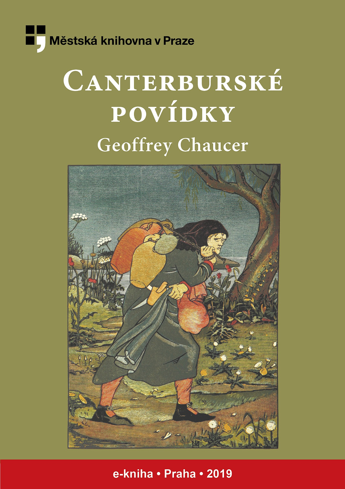

<section>

</section>

[^1]: Láska vítězí nade vším. _Pozn. překl._

[^2]: Je otázka, kterého ustanovení práva použít. Fráze, kterou půhončí nejčastěji slyšel při soudních přelíčeních. _Pozn. překl._

[^3]: Požehnejte – častý výkřik vyjadřující překvapení nebo hrůzu a přivolávající požehnání svatých ochránců. _Pozn. překl._

[^4]: Jed. _Pozn. překl._

[^5]: Do tvých rukou (se odevzdáváme, Pane) – z lat. modlitby. _Pozn. překl._

[^6]: Kdo tam? _Pozn. překl._

[^7]: Živitelko vykupitelov – označení matky Ježíšovy. _Pozn. překl._

[^8]: Probůh. _Pozn. překl._

[^9]: Na počátku (bylo slovo). Úvodní věta biblického evangelia sv. Jana. _Pozn. překl._

[^10]: Žena je mužova zkáza. Chaucer ve svém smyslu pro humor nechá Kokrháče překládat tento výrok právě opačně. _Pozn. překl._

[^11]: Kořen všeho zla je chtíč. _Pozn. překl._

[^12]: Mnohokrát děkuji. _Pozn. překl._

[^13]: Jako přednášející profesor, tedy zasvěceně. _Pozn. překl._

[^14]: Ty, který s otcem (Bohem a Duchem svátým žiješ a kraluješ jako Bůh po všechna století. Amen.). Začátek latinské žehnací formule. _Pozn. překl._

[^15]: Bůh s tímto domem – pozdrav. _Pozn. překl._

[^16]: Pravím vám bez pochyby. _Pozn. překl._

[^17]: Vyneslo srdce mé (slovo dobré) – latinská slovní hříčka, začátek pětačtyřicátého biblického žalmu, současně eructare znamená „říhati“. _Pozn. překl._

[^18]: Vyhovím, zalíbím se. Podle prvního slova biblického žalmu a křesťanského hymnu. _Pozn. překl._

[^19]: Vysvětlování neznámého pojmu ještě méně známým. _Pozn. překl._

[^20]: Doslov je obsažen v knižním vydání titulu, vzhledem k licenčním omezením nemohl být převzat do e-knihy. _Pozn. red._

[^21]: V zájmu srozumitelnosti textu a současně plynulosti četby jsou vysvětlivky cizojazyčných (většinou latinských) výrazů připojeny přímo k místu použití těchto slov či úsloví. _Pozn. red._
